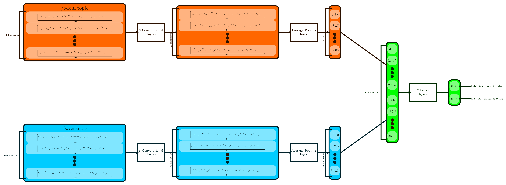

# CNN Model

This repo implementize the following CNN for time series classification using tensorflow.

It is composed of two fully connected convolutional neural networks, one for each topic used (/odom and /scan), since these are not synchronized. After these, we use a global average pooling layer is then implemented in order to compress the time dimension into a single scalar, allowing both parts to have the same number of elements, which can then be concatenated, and fed into a simple deep neural network, with $n$ outputs, $n$ being the number of classes we are trying to predict. The sum of the outputs is equal to 1, so we can interpret the result as probability of each class according to the model.

An example of usage can be found on the notebook `model_test.py`.