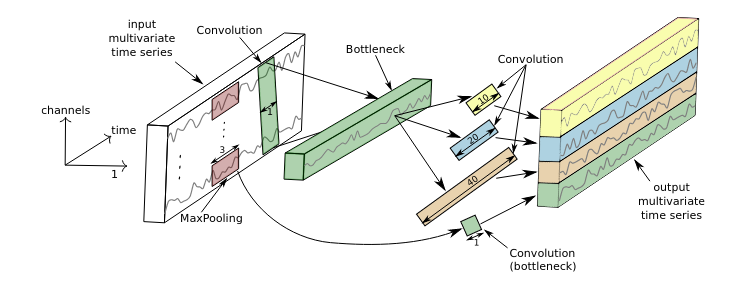

# CNN Model

This repo implementize 3 models for time series classification, with two different families of time series, series are synchronized inside the families but asynchrone between the two families. In the case of the turtlbot robot, these families are the data from the /odom topic, and the one from the /scan topic.

The following illustration shows how the implemented CNN works. 

The LSTM implementation is similar, but more lightweight, due how long the training took. There is only one LSTM layer for each branch, and the average pooling layer is replaced by simply taking the last output.

The last implementation is an adaptation of the InceptionTime network ([Fawaz et al.2019](https://arxiv.org/pdf/1909.04939.pdf)). To be precise, on each branch are 6 Inception modules, like the one one the following figure (taken from the previously cited paper).

Because the input sequences can be of variable length, the proposed input pipeline (the `data_preparation` function) uses the a `tf.data.Dataset` made out of `tf.RaggedTensor` objects. Since, for some reason, keras convolutional networks (`tf.keras.layers.Conv1D`) don't seem to support ragged tensors, for the CNN and the Inception implementation, the data is converted to a tensor, wich means it is padded when batches of size more than 1 are used. This may be a problem when testing and validation on non-padded data masking might be a way to settle this issue. Further inverstiations are necessesary (and are being conducted right now).

An example of usage can be found on the notebook `model_test.ipynb`.

# Next steps

We found that all models were good enough for the task we gave them. The issue now is that this task is still quite far from the real life problem, because our data don't have a lot of diversity, and the categories sometimes overlap IRL.

To solve this issue, we have two options. The first one would be to do the same thing, but with better datasets (ie a real-life errors and odoms/scans dataset) in this case, the developped model can directly be used with the new data.

The other option is to change paradism a bit, and to switch to semi-supervised learning. Then, we could combine out current labeled dataset with another real life unlabeled error dataset. Scikit-learns offers different types of semi-supervised learning methods and, thanks to tensorflow's sklearn wrapper, we can use the same models as with the supervised method.